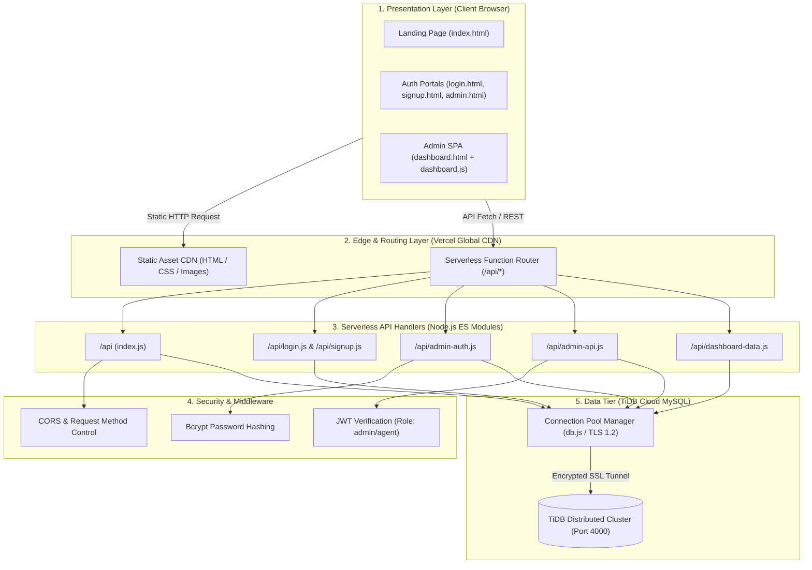
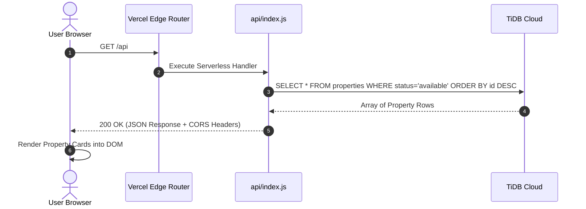
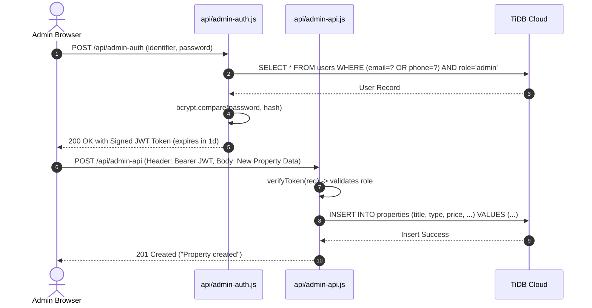

# 🏛️ System Architecture — ReadyCity Infra

## 1. Architectural Overview

ReadyCity utilizes a **Jamstack / Serverless Micro-Endpoint Architecture**. The frontend is composed of lightweight, statically served assets delivered via global edge caching, while business logic and data ingestion are handled by decoupled, stateless Node.js serverless functions connected to a distributed cloud relational database.

---

## 2. Layer-by-Layer Breakdown

### 2.1 Presentation Layer (Frontend)
* **Design Philosophy**: Minimalist, zero-framework runtime overhead using standard HTML5, modern ES6+ JavaScript, and utility-first Tailwind CSS.
* **Componentry**:
  * `public/index.html`: Public showcase containing Swiper.js image sliders, responsive navigation, and dynamic property rendering.
  * `public/login.html` & `public/signup.html`: Glassmorphism-themed customer/partner authentication views with integrated client-side CAPTCHA verification.
  * `public/admin.html` & `public/dashboard.html`: Secure administrative console featuring real-time KPI cards, dynamic tabular views, and modal-based property editors.

### 2.2 Serverless API Layer (`api/`)
* **Execution Model**: Built on Vercel's serverless function runtime using Node.js ES Modules (`"type": "module"`).
* **Endpoints**:
  * `api/index.js`: High-speed public endpoint that queries active properties (`status = 'available'`).
  * `api/signup.js`: Registration controller validating unique phone numbers and inserting customer accounts.
  * `api/login.js`: Authentication controller matching phone/username credentials.
  * `api/admin-auth.js`: Admin verification handler issuing signed JSON Web Tokens (`JWT`).
  * `api/admin-api.js`: Unified administrative controller managing aggregation queries (`stats`, `properties`, `users`, `bookings`, `leads`) and mutations (POST, PUT, DELETE).
  * `api/dashboard-data.js`: Quick summary endpoint for metrics and recent activity.

### 2.3 Security & Authorization Layer
* **JWT Stateless Sessions**: Admin routes require an `Authorization: Bearer <token>` header, decoded and validated against `JWT_SECRET` and role claims (`admin` or `agent`).
* **Cryptographic Hashing**: Passwords for administrative credentials are secure against rainbow tables using `bcryptjs`.
* **Transport Encryption**: All communication between serverless instances and TiDB Cloud enforces SSL/TLS 1.2 minimum encryption (`rejectUnauthorized: true`).

### 2.4 Data Tier (TiDB Cloud)
* **Architecture**: Distributed, cloud-native SQL database offering full MySQL 8.0 wire protocol compatibility.
* **Connection Management**:
  * Implements `mysql2/promise` connection pools.
  * Tuned for serverless runtimes with low connection limits (`connectionLimit: 1-5`, `idleTimeout: 60000ms`) to prevent connection pool exhaustion during concurrent invocation spikes.

---

## 3. Data Flow & Request Lifecycle

### Public Property Ingestion Lifecycle:

### Admin Authentication & Mutation Lifecycle:

---

## 4. Key Design Decisions

1. **Serverless Micro-Endpoints vs Monolithic Server**: By separating functions into `/api/*` endpoints, each route scales independently without requiring an always-on VM server, saving hosting cost and eliminating container maintenance.
2. **Centralized Database Pooling (`api/db.js`)**: Encapsulates database configuration and ensures TLS parameters are consistently applied across all administrative operations.
3. **Prepared Statements**: All database operations utilize parameterized queries (`?` placeholders) to prevent SQL Injection attacks.
