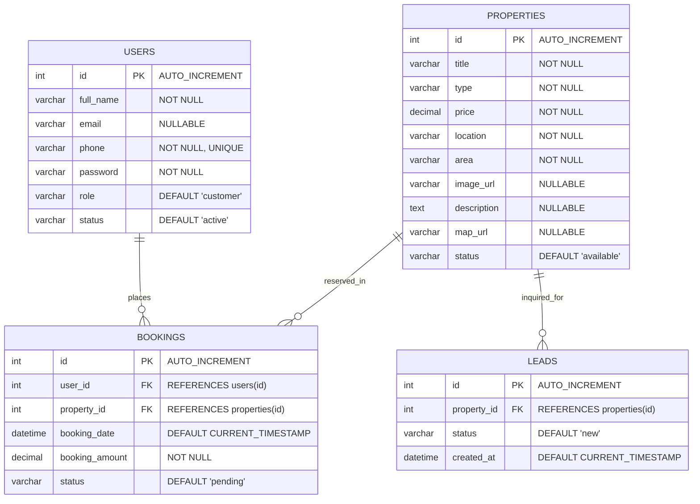

# 🗄️ Database Schema & Data Models — ReadyCity Infra

## 1. Database Architecture Overview

ReadyCity uses **TiDB Cloud**, a distributed, scalable, MySQL-compatible cloud database engine. Communication is established over secure TLS 1.2 on Port 4000 using the `mysql2/promise` driver.



---

## 2. Table Specifications

### 2.1 `users` Table
Stores authentication and profile records for customers, channel partners, agents, and administrators.

| Column | Data Type | Constraints | Description |
| :--- | :--- | :--- | :--- |
| `id` | `INT` | `PRIMARY KEY`, `AUTO_INCREMENT` | Unique identifier for the user account |
| `full_name` | `VARCHAR(100)` | `NOT NULL` | Full legal or display name |
| `email` | `VARCHAR(150)` | `NULLABLE` | Contact email address |
| `phone` | `VARCHAR(20)` | `NOT NULL`, `UNIQUE` | Primary mobile contact / login identifier |
| `password` | `VARCHAR(255)` | `NOT NULL` | Account password (hashed via bcrypt) |
| `role` | `VARCHAR(20)` | `DEFAULT 'customer'` | Access level (`customer`, `agent`, `admin`) |
| `status` | `VARCHAR(20)` | `DEFAULT 'active'` | Account status (`active`, `suspended`) |

### 2.2 `properties` Table
Stores real estate listings, specifications, media links, and availability states.

| Column | Data Type | Constraints | Description |
| :--- | :--- | :--- | :--- |
| `id` | `INT` | `PRIMARY KEY`, `AUTO_INCREMENT` | Unique property listing identifier |
| `title` | `VARCHAR(200)` | `NOT NULL` | Display headline for the plot/property |
| `type` | `VARCHAR(50)` | `NOT NULL` | Property category (`Residential`, `Commercial`, `Plot`) |
| `price` | `DECIMAL(12, 2)` | `NOT NULL` | Listing price in INR |
| `location` | `VARCHAR(150)` | `NOT NULL` | Geographic sector, city, or area name |
| `area` | `VARCHAR(50)` | `NOT NULL` | Square footage, sq yards, or dimensions |
| `image_url` | `VARCHAR(500)` | `NULLABLE` | URL/path to hero property photography |
| `description`| `TEXT` | `NULLABLE` | Full descriptive overview of the property |
| `map_url` | `VARCHAR(500)` | `NULLABLE` | Direct Google Maps location link |
| `status` | `VARCHAR(20)` | `DEFAULT 'available'` | Status (`available`, `booked`, `sold`) |

### 2.3 `bookings` Table
Tracks customer reservations, transactions, and assigned properties.

| Column | Data Type | Constraints | Description |
| :--- | :--- | :--- | :--- |
| `id` | `INT` | `PRIMARY KEY`, `AUTO_INCREMENT` | Unique booking transaction ID |
| `user_id` | `INT` | `FOREIGN KEY` $\rightarrow$ `users(id)` | User who initiated the reservation |
| `property_id`| `INT` | `FOREIGN KEY` $\rightarrow$ `properties(id)` | Property reserved |
| `booking_date`| `DATETIME` | `DEFAULT CURRENT_TIMESTAMP` | Timestamp of booking creation |
| `booking_amount`| `DECIMAL(12, 2)` | `NOT NULL` | Token or full booking payment amount |
| `status` | `VARCHAR(20)` | `DEFAULT 'pending'` | Status (`confirmed`, `pending`, `cancelled`) |

### 2.4 `leads` Table
Captures prospect inquiries and tracks follow-up status for sales teams.

| Column | Data Type | Constraints | Description |
| :--- | :--- | :--- | :--- |
| `id` | `INT` | `PRIMARY KEY`, `AUTO_INCREMENT` | Unique lead record ID |
| `property_id`| `INT` | `FOREIGN KEY` $\rightarrow$ `properties(id)` | Target property of interest |
| `status` | `VARCHAR(30)` | `DEFAULT 'new'` | Lead stage (`new`, `contacted`, `closed`) |
| `created_at` | `DATETIME` | `DEFAULT CURRENT_TIMESTAMP` | Timestamp of inquiry ingestion |

---

## 3. Relational Schema Representation

* **Users** (<u>id</u>, full_name, email, phone, password, role, status)
* **Properties** (<u>id</u>, title, type, price, location, area, image_url, description, map_url, status)
* **Bookings** (<u>id</u>, <i>user_id</i>, <i>property_id</i>, booking_date, booking_amount, status)
  * $\text{FK: } \text{user\_id} \rightarrow \text{Users(id)}$
  * $\text{FK: } \text{property\_id} \rightarrow \text{Properties(id)}$
* **Leads** (<u>id</u>, <i>property_id</i>, status, created_at)
  * $\text{FK: } \text{property\_id} \rightarrow \text{Properties(id)}$

---

## 4. Normalization Analysis

### First Normal Form (1NF)
* Every column holds atomic (indivisible) values.
* There are no repeating groups or multivalued attributes.
* A Primary Key uniquely identifies each row across all tables.

### Second Normal Form (2NF)
* Meets all 1NF requirements.
* Contains no partial dependencies: all non-key attributes are fully functionally dependent on the primary key of their respective tables.

### Third Normal Form (3NF)
* Meets all 2NF requirements.
* Eliminates transitive dependencies ($A \rightarrow B$ and $B \rightarrow C$):
  * In the `bookings` table, customer details (`full_name`, `phone`) and property details (`title`, `price`) are **not** redundantly stored. Instead, foreign keys (`user_id`, `property_id`) reference their canonical tables. Data is retrieved via SQL `JOIN` operations.

---

## 5. DDL Initialization Script

Run the following SQL in your TiDB Cloud SQL Console or MySQL Workbench to provision the entire database schema:

```sql
-- 1. Create Users Table
CREATE TABLE IF NOT EXISTS users (
    id INT AUTO_INCREMENT PRIMARY KEY,
    full_name VARCHAR(100) NOT NULL,
    email VARCHAR(150),
    phone VARCHAR(20) NOT NULL UNIQUE,
    password VARCHAR(255) NOT NULL,
    role VARCHAR(20) DEFAULT 'customer',
    status VARCHAR(20) DEFAULT 'active',
    created_at DATETIME DEFAULT CURRENT_TIMESTAMP
);

-- 2. Create Properties Table
CREATE TABLE IF NOT EXISTS properties (
    id INT AUTO_INCREMENT PRIMARY KEY,
    title VARCHAR(200) NOT NULL,
    type VARCHAR(50) NOT NULL,
    price DECIMAL(12, 2) NOT NULL,
    location VARCHAR(150) NOT NULL,
    area VARCHAR(50) NOT NULL,
    image_url VARCHAR(500),
    description TEXT,
    map_url VARCHAR(500),
    status VARCHAR(20) DEFAULT 'available',
    created_at DATETIME DEFAULT CURRENT_TIMESTAMP
);

-- 3. Create Bookings Table
CREATE TABLE IF NOT EXISTS bookings (
    id INT AUTO_INCREMENT PRIMARY KEY,
    user_id INT NOT NULL,
    property_id INT NOT NULL,
    booking_date DATETIME DEFAULT CURRENT_TIMESTAMP,
    booking_amount DECIMAL(12, 2) NOT NULL,
    status VARCHAR(20) DEFAULT 'pending',
    CONSTRAINT fk_booking_user FOREIGN KEY (user_id) REFERENCES users(id) ON DELETE CASCADE,
    CONSTRAINT fk_booking_property FOREIGN KEY (property_id) REFERENCES properties(id) ON DELETE CASCADE
);

-- 4. Create Leads Table
CREATE TABLE IF NOT EXISTS leads (
    id INT AUTO_INCREMENT PRIMARY KEY,
    property_id INT,
    status VARCHAR(30) DEFAULT 'new',
    created_at DATETIME DEFAULT CURRENT_TIMESTAMP,
    CONSTRAINT fk_lead_property FOREIGN KEY (property_id) REFERENCES properties(id) ON DELETE SET NULL
);
```
