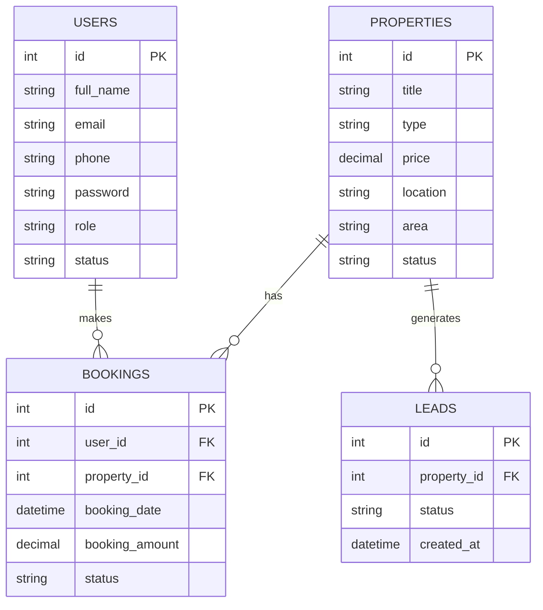

# 🏢 ReadyCity Real Estate Management System
**Database Management System Presentation Content**

---

## 1. 📌 Introduction
*   **Purpose of the system:** A centralized digital platform designed for managing real estate properties, handling client bookings, and tracking business leads efficiently.
*   **Problem statement:** Manual tracking of real estate properties, customer inquiries, and bookings across a city or agency is inefficient, error-prone, and lacks real-time analytical insights.
*   **Objectives:** 
    *   To provide an automated platform for agents and admins to manage property listings easily.
    *   To allow users to register safely and book properties.
    *   To keep track of sales leads, bookings, and revenue generation in real time.

---

## 2. 📌 System Overview
*   **Brief explanation:** The system operates on a Node.js/Express backend communicating with a relational database (TiDB/MySQL). Users can register, log in safely, and view available city properties. Administrators and agents have access to a secure dashboard to add, edit, or delete properties, monitor bookings, and update lead statuses.
*   **Real-world use case:** A developing city's municipal property portal or a modern real estate agency using the web application to digitally lease, rent, or sell residential and commercial spaces.

---

## 3. 📌 Database Design

### Entities and Attributes:
1.  **Users**
    *   `id` (Primary Key)
    *   `full_name`, `email`, `phone`, `password`
    *   `role` (e.g., admin, agent, customer)
    *   `status` (active/inactive)
2.  **Properties**
    *   `id` (Primary Key)
    *   `title`, `type` (e.g., apartment, commercial), `price`
    *   `location`, `area`, `image_url`, `description`, `map_url`
    *   `status` (e.g., available, sold, rented)
3.  **Bookings**
    *   `id` (Primary Key)
    *   `user_id` (Foreign Key)
    *   `property_id` (Foreign Key)
    *   `booking_date`, `booking_amount`
    *   `status` (e.g., confirmed, pending, cancelled)
4.  **Leads**
    *   `id` (Primary Key)
    *   `property_id` (Foreign Key)
    *   `status` (e.g., contact_attempted, closed)
    *   `created_at`

---

## 4. 📌 ER Diagram
**Description:** 
*   A **User** can make multiple **Bookings** (1:M relationship).
*   A **Property** can have multiple **Bookings** associated with it over time (1:M relationship).
*   A **Property** can generate multiple **Leads** (1:M relationship).
*   Each **Booking** explicitly links one **User** to one **Property** (M:N resolution table).

**Mermaid ER Diagram:**


---

## 5. 📌 Relational Schema
*   **Users**(<u>id</u>, full_name, email, phone, password, role, status)
*   **Properties**(<u>id</u>, title, type, price, location, area, image_url, description, map_url, status)
*   **Bookings**(<u>id</u>, <i>user_id</i>, <i>property_id</i>, booking_date, booking_amount, status)
*   **Leads**(<u>id</u>, <i>property_id</i>, status, created_at)

---

## 6. 📌 SQL Queries

**1. CREATE Table**
```sql
CREATE TABLE Users (
    id INT AUTO_INCREMENT PRIMARY KEY,
    full_name VARCHAR(100) NOT NULL,
    phone VARCHAR(15) UNIQUE NOT NULL,
    password VARCHAR(255) NOT NULL,
    role VARCHAR(20) DEFAULT 'customer'
);
```

**2. INSERT Data**
```sql
INSERT INTO Properties (title, type, price, location, status) 
VALUES ('Sunset Villa', 'Residential', 250000, 'Downtown West', 'available');
```

**3. SELECT Query (Basic & Advanced)**
```sql
-- Basic
SELECT * FROM Properties WHERE status = 'available';

-- Advanced Output (Counting total active properties)
SELECT COUNT(*) as active_properties FROM Properties WHERE status = 'available';
```

**4. JOIN Query**
```sql
-- Fetching booking details along with the user's name and property title
SELECT b.id, u.full_name, p.title, b.booking_amount, b.status 
FROM Bookings b 
JOIN Users u ON b.user_id = u.id 
JOIN Properties p ON b.property_id = p.id
ORDER BY b.booking_date DESC;
```

**5. UPDATE Query**
```sql
UPDATE Properties 
SET price = 240000, status = 'sold' 
WHERE id = 1;
```

**6. DELETE Query**
```sql
DELETE FROM Properties WHERE id = 5;
```

---

## 7. 📌 Normalization
*   **1NF (First Normal Form):** Ensures each column contains atomic values, and each record is unique. Our schema has no repeating groups or arrays.
*   **2NF (Second Normal Form):** Must be in 1NF and have no partial dependencies. All non-key attributes securely depend on the entirely primary key (`id`).
*   **3NF (Third Normal Form):** Must be in 2NF and eliminate transitive dependencies. For example, `user_name` is not stored directly in the `Bookings` table; only `user_id` is stored. To get `user_name`, we must `JOIN` the `Users` table. This prevents data duplication and update anomalies.

**Example Step-by-Step for 'Bookings':**
1.  *Unnormalized:* Bookings(booking_id, user_id, user_name, property_id, property_title, amount)
2.  *1NF/2NF:* Primary key is `booking_id`. But `user_name` depends on `user_id`, not `booking_id` (Transitive dependency).
3.  *3NF:* We move `user_name` to the `Users` table and `property_title` to the `Properties` table. `Bookings` now only perfectly contains: (<u>id</u>, user_id, property_id, booking_date, amount, status).

---

## 8. 📌 Constraints
*   **PRIMARY KEY:** Uniquely identifies each record.
    *   *Example:* `id` in tables `Users` and `Properties`.
*   **FOREIGN KEY:** Enforces referential integrity linking tables.
    *   *Example:* `user_id` in `Bookings` referencing `id` in `Users`.
*   **NOT NULL:** Ensures required fields cannot be left blank.
    *   *Example:* `full_name` and `password` cannot be null during sign-up.
*   **UNIQUE:** Stops duplicate data entries for unique identifiers.
    *   *Example:* `phone` or `email` must be unique to prevent dual registrations.
*   **CHECK:** Restricts the domain of acceptable values.
    *   *Example:* `CHECK (price >= 0)` ensures property prices are never negative.

---

## 9. 📌 Data Flow / Working
1.  **Registration & Auth:** User submits their details. System verifies the `phone` doesn't exist, encrypts the password, and creates an entry in `Users`.
2.  **Browsing Properties:** The application fetches and displays all properties where status is 'available'.
3.  **Booking Submission:** When a user books, a new record is inserted into `Bookings` containing their `user_id` and the chosen `property_id`.
4.  **Admin Management:** The admin logs into a secured portal authenticated by JWT. The system `SELECT`s overall data to render graphs (Total Users, Recent Bookings, Revenue). 
5.  **Status Update:** Admin changes a booking status or registers a lead update, executing an `UPDATE` query reflecting the new state globally.

---

## 10. 📌 Advantages of the System
*   **Data Integrity & Consistency:** Foreign key relationships assure no orphaned bookings happen if a property/user doesn't exist.
*   **Scalable Architecture:** Using a relational structure (like TiDB) correctly allows adding millions of rows without degrading fundamental read speeds.
*   **Centralized Security:** Admin APIs are shielded by token-based authentication (`JWT`), and the SQL variables prevent SQL injection.

---

## 11. 📌 Limitations
*   **Lacks Audit Logging:** Changes to a property's prices or user roles are overwritten without keeping a history of *who* amended them and *when*.
*   **Database Bottleneck:** For read-heavy operations (e.g., thousands of users querying properties simultaneously), lacking a caching layer (like Redis) might slow the queries down eventually.

---

## 12. 📌 Future Enhancements
*   **Payment Gateway Integration:** Storing encrypted transaction IDs in the `Bookings` table for real-world automated settlements.
*   **Triggers & Stored Procedures:** Implementing a Database `TRIGGER` to automatically change a Property's status to 'Sold' once a Booking is explicitly confirmed.
*   **Caching Layer:** Applying Redis to cache heavily requested queries like the public property listings.
*   **Review System:** Adding a `Reviews` table allowing users to rate their residential stays out of 5 to boost trust.
