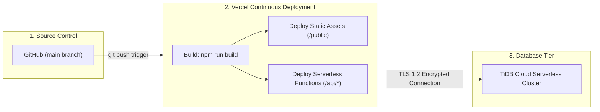

# 🚀 Production Deployment Guide — ReadyCity Infra

## 1. Deployment Architecture Overview

ReadyCity is architected for continuous delivery on **Vercel** paired with **TiDB Cloud (Serverless)**.



---

## 2. Prerequisites

1. **GitHub Repository**: Pushed code to `https://github.com/Prashant453/readycity.git`
2. **TiDB Cloud Account**: Active cluster on [TiDB Cloud Console](https://tidbcloud.com)
3. **Vercel Account**: Linked to your GitHub account on [Vercel](https://vercel.com)

---

## 3. Database Setup (TiDB Cloud)

1. **Create Cluster**:
   * Navigate to TiDB Cloud and create a **Serverless** cluster (Free Tier available).
   * Note the cluster host endpoint (e.g. `gateway01.us-east-1.prod.aws.tidbcloud.com`), port (`4000`), username, and password.
2. **Security & IP Access**:
   * Under Cluster Security / IP Access List, add `0.0.0.0/0` to allow serverless function invocations from Vercel dynamic IPs.
3. **Execute DDL Schema**:
   * Open the **SQL Editor** in TiDB Cloud and run the database schema defined in [`DATABASE_SCHEMA.md`](./DATABASE_SCHEMA.md).

---

## 4. Vercel Deployment

### Method A: Deploy via Vercel Dashboard (Recommended)

1. **Import Repository**:
   * In Vercel Dashboard, click **Add New...** $\rightarrow$ **Project**.
   * Select `readycity` from your GitHub repository list.
2. **Configure Project Settings**:
   * **Framework Preset**: `Other`
   * **Root Directory**: `./`
   * **Build Command**: `npm run build`
   * **Output Directory**: `public`
   * **Install Command**: `npm install`
3. **Set Environment Variables**:
   Add the following production environment variables under **Settings** $\rightarrow$ **Environment Variables**:

| Variable Name | Example Value | Description |
| :--- | :--- | :--- |
| `TIDB_HOST` | `gateway01.us-east-1.prod.aws.tidbcloud.com` | TiDB Cluster Host |
| `TIDB_PORT` | `4000` | Database Port (default: 4000) |
| `TIDB_USER` | `your_user.root` | Database Username |
| `TIDB_PASS` | `YourSecretPassword` | Database User Password |
| `TIDB_NAME` | `readycity_db` | Target Database Name |
| `JWT_SECRET` | `prod_super_secure_random_key_987654` | JWT Secret Key for Admin Sessions |

4. **Deploy**:
   * Click **Deploy**. Vercel will automatically build the Tailwind CSS bundle, deploy static assets to the Edge network, and deploy serverless functions to the `/api` route.

---

### Method B: Deploy via Vercel CLI

```bash
# Login to Vercel
vercel login

# Link project and deploy preview
vercel

# Deploy directly to production
vercel --prod
```

---

## 5. Post-Deployment Verification

Verify the following health checks on your production URL (`https://<project-name>.vercel.app`):

1. **Public Property Loading**:
   * Visit `https://<your-domain>/` and confirm property cards load dynamically from the database.
   * Open DevTools Network tab and verify `GET /api` returns `200 OK` with JSON array.
2. **Admin Portal Authentication**:
   * Visit `https://<your-domain>/admin.html` and attempt login.
   * Verify receiving JWT in `localStorage` and redirection to `dashboard.html`.
3. **Property Management Mutation**:
   * From the Admin Dashboard, click **Add Property** and create a test entry.
   * Confirm the new entry appears on both the dashboard and the public homepage.

---

## 6. Logs & Monitoring

* **Vercel Runtime Logs**: Navigate to **Project** $\rightarrow$ **Logs** to inspect real-time serverless execution logs and handle any potential 500 error traces.
* **TiDB Cloud Metrics**: Monitor active connection counts, query latency, and QPS in the TiDB Cloud Monitoring console.
