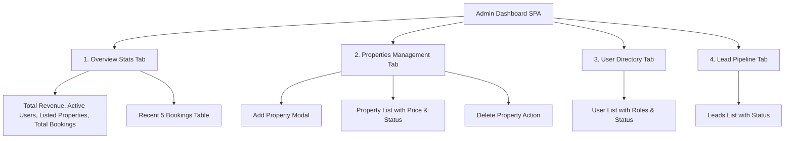

# ✨ Features & Functional Modules — ReadyCity Infra

## 1. Feature Matrix Overview

| Module | Core Functionality | Target Users | Security Level |
| :--- | :--- | :--- | :--- |
| **Public Portal** | Property browsing, geo-navigation, direct dial, gallery, testimonials | Public Visitors & Investors | Public |
| **Partner Portal** | Partner signup, phone verification, CAPTCHA authentication | Partners & Clients | Public / Session |
| **Admin Command Center** | Real-time KPI analytics, property CRUD, booking review, lead pipeline | Administrators & Agents | JWT Secured (`admin`/`agent`) |
| **Data Engine** | Distributed relational storage, ACID compliance, connection pooling | Backend Systems | TLS 1.2 Encrypted |

---

## 2. Public Real Estate Portal

### 2.1 Hero Slider & Visual Presentation
* **Dynamic Swiper Carousel**: Cinematic fade transitions with auto-play, pagination dots, and navigation arrows.
* **Branded Typography**: Clear messaging tailored for regional and metropolitan real estate development (*"हमारा सपना आपका घर हो अपना"*).

### 2.2 Dynamic Property Catalog
* **Database-Driven Feed**: Property cards populated dynamically via `GET /api` directly from TiDB Cloud.
* **Live Attribute Display**: Displays formatted INR pricing (e.g. `₹25,00,000`), location, dimension specs (e.g. `1500 sq.ft`), and property type badges (`Plot`, `Residential`, `Commercial`).
* **Direct Actions**:
  * **Map Navigation**: Direct redirection to Google Maps pinpoints via `map_url`.
  * **Click-to-Call**: Instant mobile dialer integration (`tel:+919651227779`).

### 2.3 Company Profile & Social Proof
* **About Us & Company Statistics**: Highlighting projects delivered, happy clients, and acres under development.
* **Testimonials Slider**: Multi-card responsive review carousel.
* **Integrated Contact Channels**: WhatsApp direct messaging, phone support, and office location coordinates.

---

## 3. Customer & Partner Authentication

### 3.1 Registration Subsystem (`signup.html`)
* **Input Validation**: Client-side password matching verification.
* **Collision Check**: Real-time server-side check preventing duplicate phone number registrations.
* **Safe Ingestion**: Structured payload transmission to `/api/signup`.

### 3.2 Authentication & Security Subsystem (`login.html`)
* **Dual Identifier Support**: Allows login using either phone number or username.
* **Interactive Graphic CAPTCHA**: Dynamic numeric CAPTCHA code generator preventing automated credential-stuffing attacks.
* **Password Reveal Utility**: Show/hide password toggling with dynamic icon feedback.

---

## 4. Administrative Control Center (`dashboard.html`)

### 4.1 Real-Time KPI Metric Cards
* **Revenue Metrics**: Computes aggregate confirmed booking value from the database.
* **User & Property Counts**: Real-time counts of active users and available properties.
* **Recent Activity Feed**: Immediate visibility into the latest 5 bookings with customer name, property title, and confirmation status.

### 4.2 Property Management (CRUD)
* **Create**: Modal form for creating listings with title, price, location, dimensions, and media URLs.
* **Read**: Formatted table with currency-formatted prices and status badges.
* **Update & Delete**: Immediate status toggling and single-click deletion with confirmation dialogs.

### 4.3 User & Lead Administration
* **User Directory**: View registered customers, roles (`customer`, `agent`, `admin`), and account statuses.
* **Lead Tracking**: View customer leads with connected property identifiers to track sales conversion stages.

---

## 5. Non-Functional & Operational Capabilities

* **Responsive Multi-Device Layout**: Fully adaptive across mobile, tablet, laptop, and ultra-wide displays using Tailwind CSS breakpoints.
* **SEO Optimized**: Includes `robots.txt` and `sitemap.xml` for maximum search engine discoverability.
* **Fast Time to First Byte (TTFB)**: Zero heavy client frameworks; static assets cached on global edge nodes.
* **Enterprise Security Standards**:
  * Passwords secured using standard `bcryptjs` one-way cryptographic hashing.
  * Stateless token verification using `jsonwebtoken`.
  * TLS 1.2 minimum version enforced on all database sockets.
  * Parameterized SQL queries preventing SQL Injection.
