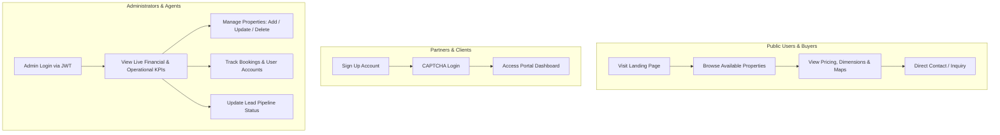

# 📋 Project Overview — ReadyCity Infra

## 1. Executive Summary

**ReadyCity** is a production-oriented real estate and property management platform built for **Ready City Infra Pvt. Ltd.** The platform serves as a modern digital gateway connecting prospective property buyers, channel partners, and administrative operators into a unified ecosystem.

By leveraging modern serverless computing and distributed cloud databases, ReadyCity delivers high reliability, sub-second query speeds, and scalable property management operations.

---

## 2. Problem Statement & Challenges

Traditional real estate and regional property agencies struggle with:
* **Fragmented Property Catalogs**: Property availability, pricing updates, and plot statuses are often tracked manually across disparate spreadsheets or offline logs.
* **Delayed Lead Ingestion**: Customer inquiries through phone calls or forms frequently suffer from lost context, slow follow-ups, and untracked conversion lifecycles.
* **Operational Inefficiencies**: Administrators lack a centralized command center to monitor live revenue, user registrations, and property inventory in real time.
* **Security & Access Control Risks**: Lack of role-based segregation between public viewers, registered partners, and system administrators.

---

## 3. Product Vision & Solution

ReadyCity addresses these core challenges with an integrated architecture:

1. **Digital-First Public Portal**: Delivers interactive, filterable property listings directly from a cloud database with geographic navigation and quick calling.
2. **Dedicated Partner Portal**: Streamlines customer and partner onboarding with secure phone/name registration and CAPTCHA-verified authentication.
3. **Comprehensive Admin Command Center**: Empowers administrators and agents with real-time KPI metrics, instantaneous property CRUD operations, user directory management, and lead lifecycle tracking.

---

## 4. Target User Personas & Workflows

### Persona 1: Property Buyer / Prospective Investor
* **Needs**: Access to verified property plots, transparent pricing, location maps, and instant contact channels.
* **User Journey**: Arrives on the landing page $\rightarrow$ reviews hero highlights $\rightarrow$ inspects active properties $\rightarrow$ clicks location link or direct call button.

### Persona 2: Registered Partner / Client
* **Needs**: Secure account creation to interact with Ready City Infra initiatives.
* **User Journey**: Registers with name and phone number $\rightarrow$ logs in via CAPTCHA-secured portal $\rightarrow$ receives authenticated session.

### Persona 3: System Administrator & Agent
* **Needs**: Centralized data governance, inventory control, and transaction monitoring.
* **User Journey**: Authenticates via `/admin.html` with encrypted credentials $\rightarrow$ receives JWT session $\rightarrow$ monitors revenue, property count, bookings, and updates lead statuses.

---

## 5. Technology Stack Rationale

| Layer | Technology Choice | Strategic Rationale |
| :--- | :--- | :--- |
| **Frontend UI** | HTML5, Tailwind CSS, Vanilla JS | Zero framework overhead, near-instant First Contentful Paint (FCP), highly customizable utility-first styling. |
| **Backend Compute** | Serverless Node.js (Vercel Functions) | Auto-scales with traffic bursts, zero idle server maintenance costs, isolated micro-endpoint execution. |
| **Relational Database** | TiDB Cloud (MySQL-Compatible) | Cloud-native distributed SQL engine with high availability, ACID compliance, and standard MySQL dialect compatibility. |
| **Authentication** | JWT & Bcrypt | Industry-standard stateless session tokens for API scalability combined with strong cryptographic password hashing. |

---

## 6. Business Impact & Measurable Value

* **Zero-Downtime Scalability**: Serverless compute automatically scales during marketing campaigns without server provisioning bottlenecks.
* **Sub-Second Property Discovery**: Database-level indexing and lightweight UI assets ensure immediate loading on low-bandwidth mobile networks.
* **Centralized Data Integrity**: Foreign key relationships guarantee zero orphaned booking records and transparent audit trails for administrative operations.
