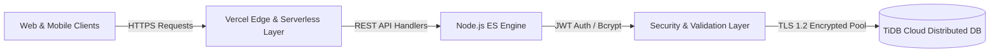

# ReadyCity Infra

> **Production-grade Real Estate & Property Management Platform** built with high-performance serverless architecture, responsive user interfaces, and distributed cloud relational storage.

[](#tech-stack)
[-blue?style=flat-square)](./DATABASE_SCHEMA.md)
[](./DEPLOYMENT.md)
[](./LICENSE)

---

## 📌 Executive Summary

**ReadyCity** is an end-to-end web platform engineered for **Ready City Infra Pvt. Ltd.** to streamline property discovery, partner onboarding, customer lead management, and administrative control. It eliminates manual, fragmented workflows by unifying property listings, live booking tracking, and business metrics into a unified, secure system.



---

## 🚀 Key Highlights

* **High-Performance Public Portal**: Dynamic property catalog with real-time database queries, geo-location mapping, responsive Swiper carousels, and instant direct-dial calling.
* **Role-Based Admin Dashboard**: Single-page administration dashboard displaying financial metrics (revenue, active bookings, property counts), property CRUD operations, user directory, and lead status pipeline.
* **Secure Authentication & Authorization**: Stateless JWT token authentication for administrative functions, `bcryptjs` cryptographic password hashing, and dynamic client-side CAPTCHA protection.
* **Serverless Cloud Architecture**: Serverless Node.js endpoints with connection-pool optimization running on Vercel, paired with a MySQL-compatible distributed TiDB database.

---

## 🛠️ Tech Stack

| Layer | Technologies & Tools |
| :--- | :--- |
| **Frontend** | HTML5, Tailwind CSS, Vanilla JavaScript (ES6+), Swiper.js, Lucide Icons, FontAwesome 6 |
| **Backend** | Node.js (ES Modules), Vercel Serverless Functions (`/api/*`) |
| **Database** | TiDB Cloud (Distributed MySQL-compatible Relational Database) |
| **Security** | JSON Web Tokens (`jsonwebtoken`), `bcryptjs`, TLS v1.2 SSL Database Tunneling |
| **Hosting & CI/CD** | Vercel Serverless Platform, GitHub Integration |

---

## 📁 Repository Structure

```
readycity/
├── api/                     # Serverless backend micro-endpoints
│   ├── admin-api.js         # Protected admin CRUD & aggregated analytics
│   ├── admin-auth.js        # Admin authentication & JWT token generation
│   ├── dashboard-data.js    # Metric aggregation endpoint
│   ├── db.js                # Centralized TiDB connection pooling module
│   ├── index.js             # Public property listings endpoint
│   ├── login.js             # User/partner authentication handler
│   └── signup.js            # User/partner registration handler
├── public/                  # Static frontend client assets
│   ├── images/              # Optimized static photography & branding
│   ├── js/
│   │   └── dashboard.js     # Admin dashboard SPA logic & API controller
│   ├── admin.html           # Admin portal authentication screen
│   ├── dashboard.html       # Protected management dashboard
│   ├── index.html           # Public landing page & property catalog
│   ├── login.html           # Partner login portal with CAPTCHA
│   ├── signup.html          # Partner registration interface
│   ├── robots.txt           # Search engine indexing directives
│   ├── sitemap.xml          # SEO sitemap configuration
│   └── style.css            # Custom CSS & animation rules
├── src/
│   └── input.css            # Tailwind CSS source entrypoint
├── .env.example             # Safe environment variable configuration template
├── .gitignore               # Repository ignore rules
├── package.json             # NPM dependencies & build scripts
└── tailwind.config.js       # Tailwind CSS theme extension
```

---

## 📚 Complete Project Documentation

For in-depth architectural analysis, database models, and operational guides, please explore the dedicated documentation suite:

* 📖 **[Project Overview](./PROJECT_OVERVIEW.md)**: Product vision, user personas, problem statement, and business value.
* 🏛️ **[System Architecture](./ARCHITECTURE.md)**: Tier breakdown, data flow, serverless lifecycle, and security model.
* 🗄️ **[Database Schema](./DATABASE_SCHEMA.md)**: Entity Relationship Diagram (ERD), table structures, keys, constraints, and normalization.
* 🔌 **[API Documentation](./API_DOCUMENTATION.md)**: Complete REST API reference, request/response payloads, and status codes.
* ⚡ **[Local Setup & Development](./SETUP.md)**: Step-by-step developer setup, database provisioning, and local execution.
* ✨ **[Features & Capabilities](./FEATURES.md)**: Comprehensive catalog of public, partner, and administrative features.
* 🚀 **[Deployment Guide](./DEPLOYMENT.md)**: Production deployment instructions for Vercel and TiDB Cloud.

---

## ⚡ Quick Start

### 1. Prerequisites
* **Node.js**: `v18.0.0` or higher
* **npm**: `v9.0.0` or higher
* **Database**: Active TiDB Cloud or MySQL instance

### 2. Installation
```bash
# Clone the repository
git clone https://github.com/Prashant453/readycity.git

# Navigate to project directory
cd readycity

# Install dependencies
npm install
```

### 3. Environment Configuration
Copy the configuration template and populate with your credentials:
```bash
cp .env.example .env
```

### 4. Run Development Server
```bash
# Compile CSS assets
npm run build

# Start local server or run with Vercel CLI
npm start
# OR
vercel dev
```

Visit `https://readycity-iota.vercel.app/` to interact with the application.

---

## 🔒 Security & Best Practices

* **No Hardcoded Secrets**: All database and auth keys are managed via environment variables.
* **SQL Injection Prevention**: Parameterized queries across all database drivers.
* **Encrypted Data In Transit**: TLS 1.2 minimum version enforced on all database sockets.
* **Stateless Authorization**: JWT token verification on administrative endpoints.

---

## 👤 Author & Maintainer

**Ayush Kumar Singh**
* **Project**: Ready City Infra Pvt. Ltd.
* **GitHub**: [@Ayush-28s](https://github.com/Ayush-28s)
* **Organization**: Ready City Infra Pvt. Ltd.
